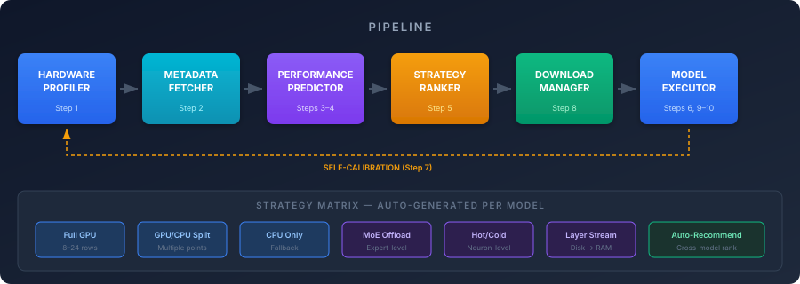
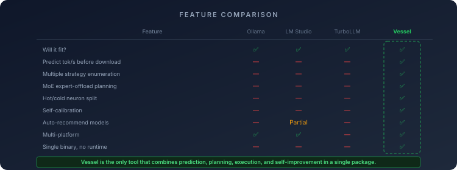
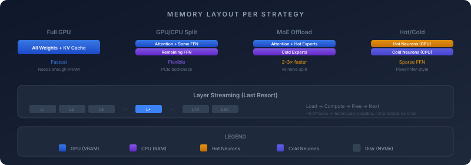
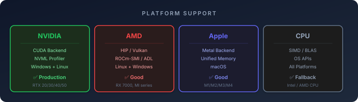

<p align="center">
  
</p>

<h1 align="center">Vessel</h1>

<p align="center">
  <strong>The local LLM deployment tool that tells you exactly how to run any model on your hardware — before you download a single gigabyte.</strong>
</p>

<p align="center">
  <a href="#quick-start">Quick Start</a> •
  <a href="#features">Features</a> •
  <a href="#cli-reference">CLI Reference</a> •
  <a href="#building">Building</a> •
  <a href="#contributing">Contributing</a>
</p>

---

## Quick Start

### Install (one command)

**Linux / macOS:**
```bash
curl -fsSL https://raw.githubusercontent.com/bhuwanb23/vessel/main/install.sh | bash
```

**Windows (PowerShell):**
```powershell
powershell -c "irm https://raw.githubusercontent.com/bhuwanb23/vessel/main/install.ps1 | iex"
```

Or download a binary directly from [**Releases**](https://github.com/bhuwanb23/vessel/releases/tag/v0.1.0).

### Usage

```bash
# See what models fit your hardware
vessel --recommend

# Check a specific model
vessel --model https://huggingface.co/bartowski/Llama-3.2-3B-Instruct-GGUF/resolve/main/Llama-3.2-3B-Instruct-Q4_K_M.gguf

# Download and run
vessel --model <url> --execute

# Start an OpenAI-compatible API server (drop-in for Ollama)
vessel --serve --models-dir ./models
```

---

## Features

<p align="center">
  
</p>

| Feature | Description |
|---------|-------------|
| Zero-download prediction | Fetches only the GGUF header (64KB–2MB) to predict memory, speed, and latency |
| Strategy enumeration | Generates 8–24 deployment strategies per model |
| Auto-recommendation | Curated catalog of 23 model variants across 7 families |
| MoE expert-offload | Native support for Mixtral, DeepSeek, Qwen-MoE |
| Hot/cold neuron split | PowerInfer-style sparse FFN for oversized dense models |
| Layer-streaming fallback | AirLLM-style sequential layer loading for extreme cases |
| Self-calibration | Predicted vs. actual comparison, gets smarter over time |
| Multi-platform | NVIDIA, AMD, Apple Silicon, CPU-only |
| Confidence bands | HIGH / MEDIUM / LOW with honest uncertainty |
| Resumable downloads | HTTP Range, SHA256 verification, multi-shard support |

---

## How It Works

```
$ vessel --model https://huggingface.co/.../Llama-3.2-3B-Q4_K_M.gguf

Hardware: RTX 4070 (12GB VRAM, 10.2 free) | 32GB RAM | NVMe 5.1/0.3 GB/s
Model:    Llama 3.2 3B Instruct Q4_K_M | 2.84B params | 28 layers

 #  Placement    GPU Layers  Context  KV    VRAM     RAM     tok/s    TTFT    Status
 1  Full GPU     28         4K       Q8    2.5 GB   -       ~53      ~5s     ✅ VIABLE
 2  Full GPU     28         4K       FP16  2.7 GB   -       ~53      ~5s     ✅ VIABLE
 3  Split        14         4K       Q8    1.4 GB   1.1 GB  ~28      ~9s     ✅ VIABLE
 4  CPU Only     0          4K       Q8    -        2.1 GB  ~19      ~29s    ✅ VIABLE

💡 Fastest: #1 Full GPU at ~53 tok/s.
```

---

## Memory Layout

<p align="center">
  
</p>

---

## Platform Support

<p align="center">
  
</p>

| Platform | Backend | Status |
|----------|---------|--------|
| Windows + NVIDIA | CUDA | ✅ Production |
| Linux + NVIDIA | CUDA | ✅ Production |
| Linux + AMD | ROCm/HIP | ✅ Good |
| Windows + AMD | Vulkan | ⚠️ Experimental |
| macOS + Apple Silicon | Metal | ✅ Good |
| CPU-only | CPU | ✅ Production |

---

## CLI Reference

```
Usage: vessel --model <url_or_path> [options]

Model:
  --model <url_or_path>               Hugging Face GGUF URL or local file
  --model-path <path>                 Local GGUF file (for --model URL)
  --download-dir <path>               Directory to download models (default: ~/models)

Prediction:
  --priority <speed|quality|safety>   Rank by (default: speed)
  --context <4k|max|both>             Contexts to evaluate (default: both)
  --verbose                           Full hardware & model reports

Execution:
  --execute                           Run inference after planning
  --skip-verify                       Skip SHA256 verification on download
  --prompt <text>                     Prompt for inference (default: benchmark)
  --max-tokens <N>                    Max tokens to generate (default: 100)

Platform:
  --platform <cuda|hip|metal|cpu>     Force specific platform (default: auto-detect)
  --gpu <index>                       Select GPU by index (for multi-GPU systems)
  --gpu-name <pattern>                Select GPU by name pattern (e.g., 'RTX 4090')

API Server (Step 14):
  --serve                             Start OpenAI-compatible API server (port 11434)
  --api-port <port>                   API server port (default: 11434)
  --models-dir <path>                 Directory to scan for .gguf models (repeatable)

Web Dashboard (Step 13):
  --serve-ui                          Start web dashboard (localhost:8080)
  --port <port>                       Dashboard port (default: 8080)
  --bind <addr>                       Bind address (default: 127.0.0.1)
  --no-browser                        Don't auto-open browser for dashboard

Recommendation:
  --recommend                         Show model recommendations for your hardware
  --use-case <chat|coding|...>        Filter recommendations by use case
  --max-download <GB>                 Max download size in GB (e.g., 5)
  --top <N>                           Number of recommendations to show (default: 8)
  --catalog <path>                    Path to custom catalog JSON file

Calibration:
  --calibration-info                  Show calibration log stats
  --calibration-reset                 Delete calibration log (with confirm)

Advanced:
  --profile-neurons                   Run neuron activation profiling
  --hot-ratio <0.0-1.0>              Target hot neuron ratio (default: 0.15)
  --vram-budget <GB>                  VRAM budget for hot neurons (default: auto)
```

**See [docs/cli-reference.md](docs/cli-reference.md) for detailed examples.**

---

## Supported Models

| Family | Sizes | Quants |
|--------|-------|--------|
| Llama 3.2 | 1B, 3B | Q4_K_M, Q8_0 |
| Llama 3.1 | 8B | Q3_K_M, Q4_K_M, Q5_K_M, Q8_0 |
| Qwen 2.5 | 3B, 7B, 14B | Q4_K_M, Q5_K_M |
| Mistral | 7B | Q4_K_M, Q5_K_M |
| Phi 3.5 | Mini (3.8B) | Q4_K_M, Q8_0 |
| Gemma 2 | 2B, 9B | Q4_K_M |
| DeepSeek V2 | Lite (16B MoE) | Q4_K_M |
| Mixtral | 8×7B (MoE) | Q3_K_M, Q4_K_M |

Any GGUF model from Hugging Face works with `--model <url>`.

---

## Building from Source

### Prerequisites

- CMake 3.20+
- C++17 compiler (MSVC 17+, GCC 11+, Clang 14+)
- CUDA Toolkit 12+ (for NVIDIA builds)

### Build

```bash
git clone https://github.com/bhuwanb23/vessel.git
cd vessel

# NVIDIA
cmake -B build -DGGML_CUDA=ON
cmake --build build --config Release

# AMD (Linux)
cmake -B build -DGGML_HIPBLAS=ON
cmake --build build

# Apple Silicon
cmake -B build -DGGML_METAL=ON
cmake --build build

# CPU-only
cmake -B build
cmake --build build
```

### Run Tests

```bash
cd build/bin/Release  # or Debug
./e2e_test
./recommend_test
./catalog_test
./step11_test
```

### Install from source

```bash
# Linux / macOS
sudo cp build/bin/Release/vessel /usr/local/bin/

# Windows (run as Administrator)
copy build\bin\Release\vessel.exe C:\Users\<you>\.vessel\bin\
```

---

## Calibration

Vessel learns from every execution. After running a model, it logs actual performance and uses it to improve future predictions on the same hardware.

```bash
vessel --calibration-info    # View calibration stats
vessel --calibration-reset   # Start fresh
```

Calibration data: `%APPDATA%\vessel\calibration.jsonl` (Windows) or `~/.config/vessel/calibration.jsonl` (Linux/macOS).

---

## Contributing

See [CONTRIBUTING.md](CONTRIBUTING.md) for guidelines.

---

## License

[MIT](LICENSE)

---

## Acknowledgments

- [llama.cpp](https://github.com/ggerganov/llama.cpp) — Inference engine
- [PowerInfer](https://arxiv.org/abs/2312.12456) — Hot/cold neuron split research
- [AirLLM](https://github.com/lyogavin/airllm) — Layer-streaming research
- [Hugging Face](https://huggingface.co) — Model hosting and GGUF format
