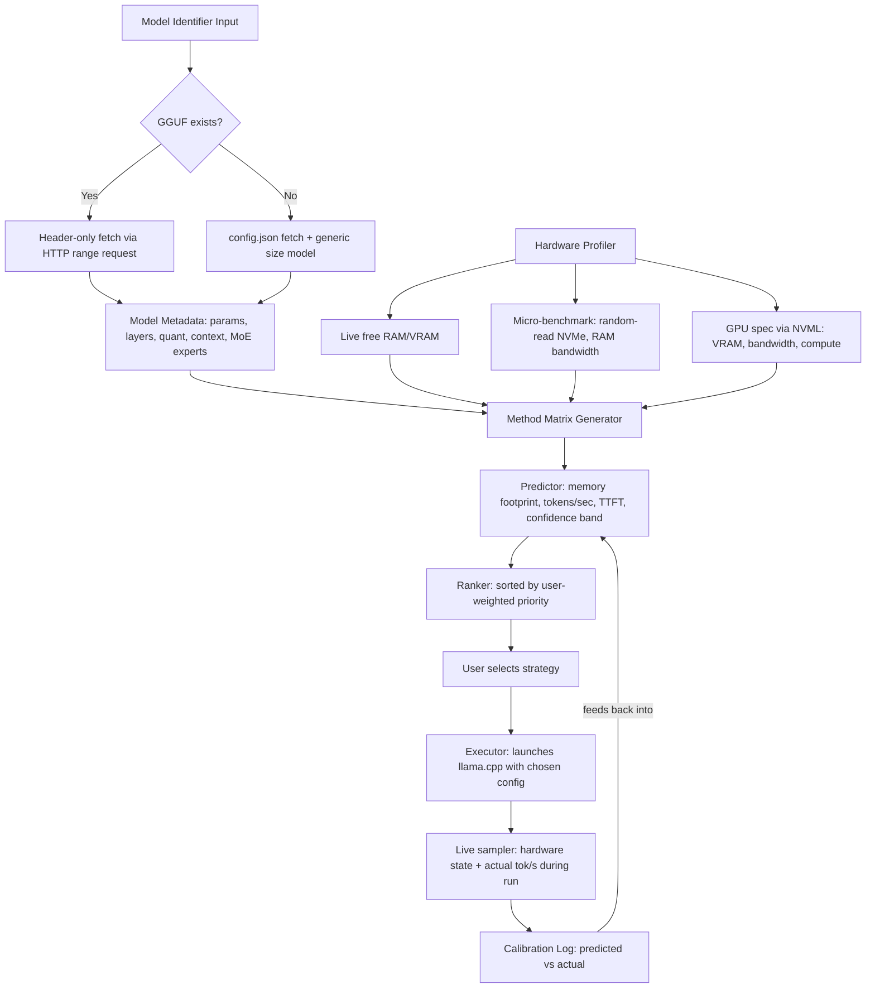

# Local LLM Deployment Planner — MVP Specification

**Status:** Design lock v1
**Scope of this doc:** Problem, evidence, architecture, formulas, and MVP boundaries only. No implementation code.

---

## 1. Problem Statement

Existing local-LLM tooling answers exactly one question: *"will this model fit?"* Ollama, LM Studio, and every VRAM calculator on the market (TurboLLM, ModelFit, VRAMCalculator, GPUforLLM, WillItRunAI, HuggingFace's GGUF calculator) compute weight size + KV cache size against your VRAM/RAM and return a green/yellow/red verdict.

None of them:

1. Enumerate **multiple execution strategies** for the same model on the same hardware (GPU-only vs GPU+CPU split vs CPU+mmap vs MoE expert-offload) and rank them against each other.
2. Predict **tokens/sec, time-to-first-token, and memory pressure** per strategy before any download happens.
3. Warn about second-order failure modes (thermal throttling mid-run, OS swap vs read-only mmap streaming, background-process memory contention) that only show up in practice.
4. **Execute** the chosen strategy and compare predicted vs. actual performance afterward.

This is a genuine gap, confirmed by market scan (Aug 2026): every current tool stops at "fit check." This project is a **deployment planner + execution engine**, not another calculator.

---

## 2. Product Vision

> Given a model (or model family) and a physical machine, tell the user every viable way to run it, with honest, uncertainty-bounded predictions for each, let them choose by what they care about (speed / quality / safety margin), then run it — and get smarter every time it runs.

---

## 3. Design Stress-Test — Problems Found and Resolutions Locked

Each item below was identified as a flaw in the raw design, with the resolution now locked into the architecture.

| # | Problem | Why it breaks the raw design | Locked resolution |
|---|---|---|---|
| 1 | "Predict without downloading" only half-holds | GGUF header-only fetch (HTTP range request, few KB) works if a pre-quantized GGUF already exists. If it doesn't, there's nothing to read a header from — full-precision weights would need downloading just to quantize. | Two prediction paths: **(a) GGUF exists** → fetch header, high-confidence prediction. **(b) No GGUF** → predict from `config.json` (safetensors) using generic per-format size/quality models, flagged **low-confidence, unverified**. |
| 2 | Static hardware specs lie | Advertised NVMe sequential-read and real random-read-under-load speed can differ 3–5×. MoE expert-offload is random access, not sequential — the exact case where spec-sheet numbers are most wrong. | Profiler runs a **real micro-benchmark** (random 4K–1MB block reads, ~2–5 sec) instead of trusting `lscpu`/spec sheets. |
| 3 | Total capacity ≠ available capacity | OS, browser, background apps already occupy RAM/VRAM. Predicting against nameplate specs tells users things fit when they don't. | Profiler reads **live free memory** at prediction time, re-checks immediately before execution (state drifts between planning and running). |
| 4 | MoE routing is workload-dependent | Expert activation depends on prompt content — one true tokens/sec number is impossible for expert-offload; cache-hit rate varies by conversation. | Report a **range** (best case = hot expert cache, worst case = cold miss every token), not a point estimate. Explicitly flagged as fuzzier than dense-model prediction. |
| 5 | No clean formula for quality loss | Quantization-vs-quality degradation isn't derivable from architecture; it needs real perplexity/benchmark data that doesn't exist for every model×quant pair. | Show quality delta **only** where real benchmark data exists (published perplexity/quant comparisons). Otherwise: *"no quality data available for this quant"* — never a guessed number. |
| 6 | Context length treated as fixed | KV cache scales linearly with context; advertised max context is rarely usable on constrained hardware. | Show tokens/sec and memory footprint **as a function of context length**; propose a safe default rather than assuming max. |
| 7 | "SSD wear" claim was imprecise | mmap-based weight streaming is read-heavy; NAND wear is driven mainly by **writes**, not reads. The real risk is speed/heat, not wear — unless the OS starts true swap (writing dirty pages because RAM is oversubscribed), which is a distinct, worse failure mode. | Warnings layer distinguishes **read-only mmap streaming** (safe, just slow) from **true OS swap** (wear + severe slowdown) explicitly. |
| 8 | Hardware state drifts during a run | A profile taken at idle is wrong 10 minutes into a sustained run once a laptop throttles. | Executor **samples hardware state during the run**; predicted-vs-actual divergence is shown, not hidden. |
| 9 | "Best method" is subjective | Fastest, lowest-memory-pressure, and highest-quality are usually three different strategies; picking one winner imposes an opinion. | Ranker takes a **user-weighted priority** (speed / quality / safety margin) and re-sorts; no single hardcoded "best." |
| 10 | Full hardware-platform coverage is too large for v1 | NVML (NVIDIA), ROCm-SMI (AMD), Metal/IOKit (Apple), DirectML (Windows) are separate code paths each. Chasing all of them stalls the project before MVP ships. | **MVP = Linux + NVIDIA + CPU/RAM/NVMe only.** Other platforms are follow-on modules behind the same interface (see §6). |
| 11 | No feedback loop | Every formula is an approximation; without logging predicted-vs-actual and recalibrating, accuracy never improves past launch day. | **Calibration log** is a day-one component, not a v2 feature (see §7). |

---

## 4. MVP Scope Lock

**In scope:**
- OS/platform: **Linux**
- GPU: **NVIDIA only** (NVML)
- Execution backends: **llama.cpp** (GGUF, CPU/CUDA), with an interface designed to add `ik_llama.cpp`/`ktransformers` (MoE expert-offload) in Phase 2
- Model class: **dense models only** for v1 prediction accuracy; MoE models can run via llama.cpp but expert-offload-aware prediction is Phase 2
- Storage: local NVMe read profiling (random + sequential)
- Output: ranked list of viable strategies with predicted metrics + confidence bands, user selects, tool executes, logs actual results

**Explicitly out of scope for MVP:**
- AMD/ROCm, Apple Metal, Windows/DirectML
- MoE expert-offload—aware prediction (dense-model math only; MoE will run but with degraded prediction confidence)
- Multi-node/distributed inference
- Fine-tuning/training workloads (Unsloth-style) — this is inference-planning only for v1
- Quality-delta scoring where no published benchmark data exists

**Phase roadmap:**

| Phase | Adds |
|---|---|
| **MVP** | Linux + NVIDIA + CPU/RAM/NVMe, dense models, llama.cpp backend, calibration log |
| **Phase 2** | MoE expert-offload prediction + ik_llama.cpp/ktransformers backend |
| **Phase 3** | AMD (ROCm-SMI) + Apple Silicon (Metal/IOKit) |
| **Phase 4** | Multi-GPU / multi-node, training-workload planning |

---

## 5. System Architecture



**Components:**

1. **Metadata Fetcher** — GGUF header range-request parser; safetensors `config.json` fallback parser
2. **Hardware Profiler** — NVML wrapper (VRAM, bandwidth, thermals), `/proc/meminfo`/`statvfs` reader, micro-benchmark runner (random + sequential NVMe read, RAM bandwidth via simple memcpy test)
3. **Method Matrix Generator** — enumerates valid (backend × quantization × placement × context) combinations for the given model + hardware
4. **Predictor** — applies formulas in §8 per matrix entry, with confidence bands
5. **Ranker** — user-weighted sort (speed / quality / safety margin), no single hardcoded winner
6. **Executor** — links against `llama.cpp`/`ggml` directly (not subprocess-only), applies chosen config, samples live hardware state during the run
7. **Calibration Log** — structured record of every run's prediction vs. actual, keyed by hardware fingerprint, used to adjust per-backend overhead constants over time

---

## 6. Platform Interface Design

Even though MVP is Linux+NVIDIA only, the profiler and executor are built behind a common interface (`IHardwareProfiler`, `IExecutionBackend`) so Phase 2/3 platforms are additive, not a rewrite. This is a scope decision to prevent premature breadth (see §3, item 10) without painting the architecture into a corner.

---

## 7. Calibration Log — Format Lock

Every executed run appends one record:

```
{
  "hardware_fingerprint": "<cpu_model>|<gpu_model>|<ram_total>|<nvme_model>",
  "model_id": "<hf_repo>/<gguf_filename>",
  "strategy": {"backend": "...", "quant": "...", "placement": "...", "context": ...},
  "predicted": {"tokens_per_sec": ..., "ttft_ms": ..., "confidence": "..."},
  "actual": {"tokens_per_sec": ..., "ttft_ms": ..., "peak_ram": ..., "peak_vram": ..., "throttled": bool},
  "timestamp": "..."
}
```

This log is the mechanism behind item #11's resolution — per-hardware-class calibration constants are derived from aggregating these records, not hardcoded.

---

## 8. Predictor Formulas — Locked

### 8.1 Memory Footprint

```
weight_bytes = total_params × bits_per_weight / 8
# MoE: total_params = shared_params + (num_experts × expert_params) — footprint only, not compute

kv_cache_bytes = 2 × n_layers × n_kv_heads × head_dim × context_len × batch × bytes_per_elem
# Architecture-aware: MLA-style attention (DeepSeek/Kimi-class) compresses this to a
# small latent dimension instead of full per-head KV. Separate formula branch required —
# one formula does not fit both attention families.

total_memory = weight_bytes + kv_cache_bytes + runtime_overhead(backend)
# runtime_overhead is an empirical per-backend constant, calibrated from the log in §7,
# not derived analytically (CUDA context, driver overhead, compute buffers vary by backend/version)
```

### 8.2 Decode Speed (tokens/sec)

Decode at batch=1 is **memory-bandwidth-bound**: every token requires reading all active weights once.

```
active_params = shared_params + (experts_per_token × expert_params)   # dense model: active_params = total_params
bytes_per_token = active_params × bits_per_weight / 8
tokens_per_sec ≈ effective_bandwidth / bytes_per_token
```

`effective_bandwidth` source by regime:

| Regime | Bandwidth source | Note |
|---|---|---|
| Fully in VRAM | GPU memory bandwidth (GB/s, from NVML) | Ceiling case |
| Split GPU+CPU | `1 / (t_gpu + t_cpu)`, where `t_x = bytes_x / bandwidth_x` | Sequential dependency — slower side dominates total time |
| CPU + RAM only | Measured system RAM bandwidth (memcpy micro-benchmark) | Multi-channel config matters significantly |
| MoE expert-offload from NVMe (Phase 2) | **Measured random-read** bandwidth, weighted by expert cache-hit rate | Reported as range, not point estimate — see §3 item 4 |

### 8.3 Prefill / Time-to-First-Token

Prefill is **compute-bound** (whole prompt processed in parallel), not bandwidth-bound — a separate formula and a separate measured constant from §8.2, not a reuse of the bandwidth figure.

```
TTFT ≈ prompt_tokens × FLOPs_per_token / device_compute_throughput
```

`device_compute_throughput` = measured GPU TFLOPS or CPU vector throughput (AVX-512/AMX), not spec-sheet peak FLOPS — peak FLOPS is rarely achieved in practice and should be calibrated down via §7 log data.

### 8.4 Confidence Bands

Every predicted number ships with an explicit band, not a bare point estimate:

- **High confidence:** GGUF header available + ≥5 calibration records for this hardware fingerprint
- **Medium confidence:** GGUF header available, <5 calibration records (first runs on new hardware)
- **Low confidence:** No GGUF (config.json fallback), and/or MoE cache-hit-rate-dependent prediction

---

## 9. Tech Stack Lock

| Layer | Choice | Reason |
|---|---|---|
| Language | C++ | Executor links directly into `ggml`/`llama.cpp` internals; hardware polling (NVML, `/proc`, `statvfs`) is native systems-programming territory |
| Inference backend | `llama.cpp` (MVP), `ik_llama.cpp`/`ktransformers` (Phase 2) | Linked as a library, not subprocess — enables live stats and fine-grained placement control (`n_gpu_layers`, KV quant, batch size) |
| HTTP (metadata fetch) | `libcurl` | Range-request support for GGUF header-only fetch |
| JSON parsing | `nlohmann::json` or `simdjson` | `config.json` fallback path, calibration log I/O |
| GPU telemetry | NVML | VRAM, bandwidth, thermals, live sampling during runs |
| CPU/RAM/topology | `hwloc`, `/proc/meminfo` | NUMA-awareness matters for RAM bandwidth prediction accuracy |

Rationale note: full C++ is justified here specifically because the executor requires direct library-level access to inference internals and OS/driver-level hardware APIs — not a default assumption for every module (metadata fetch + ranking arithmetic would be simpler in a scripting language in isolation, but staying single-binary avoids a second runtime dependency).

---

## 10. Open Questions Before Build Start

1. Micro-benchmark duration budget — how many seconds of NVMe/RAM benchmarking is acceptable before the user perceives the tool as slow to give a first answer?
2. Calibration log storage — local file only, or opt-in aggregation across users to bootstrap predictions for hardware nobody on this machine has tested yet?
3. Minimum viable "method matrix" size for MVP demo — full cross-product of every axis in §5's method matrix, or a curated subset (e.g. skip context-length sweeps in v1, fix at 2 sensible values)?

---

*End of MVP specification.*